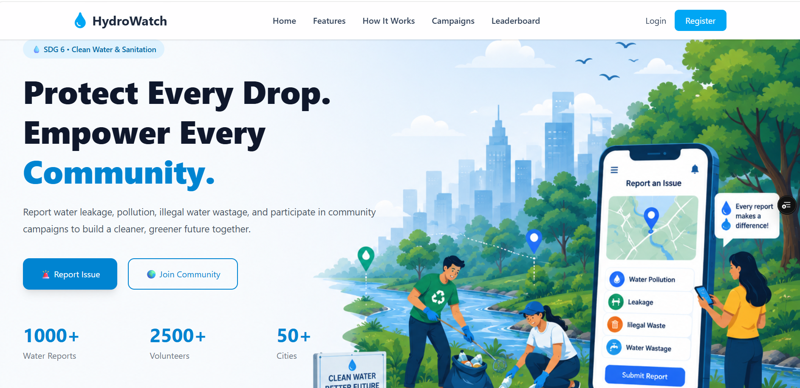
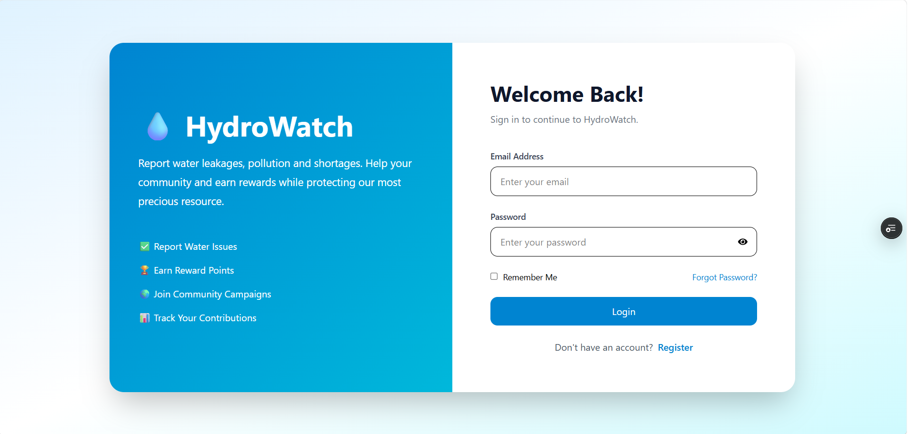
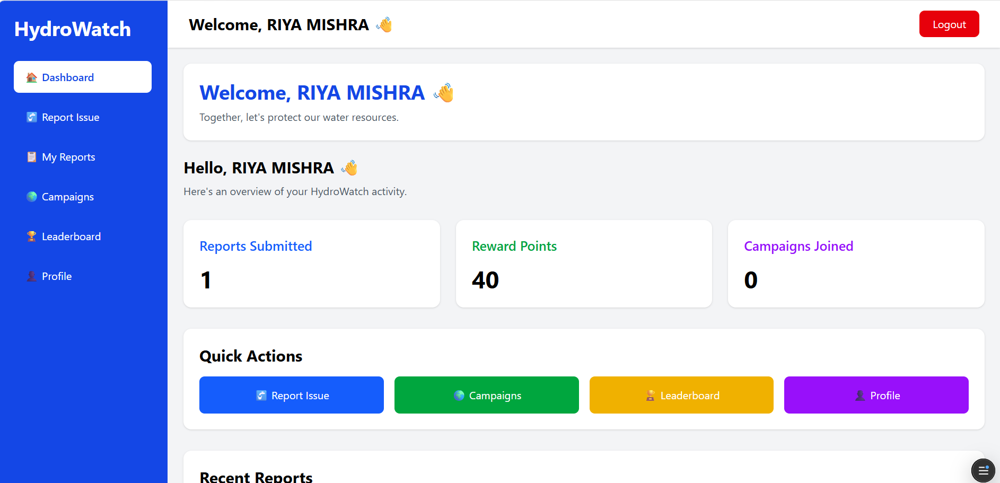
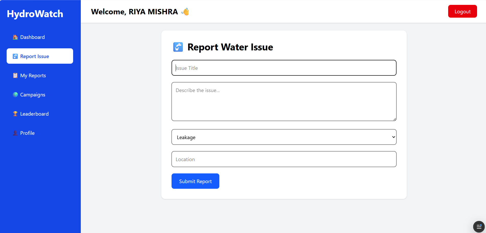
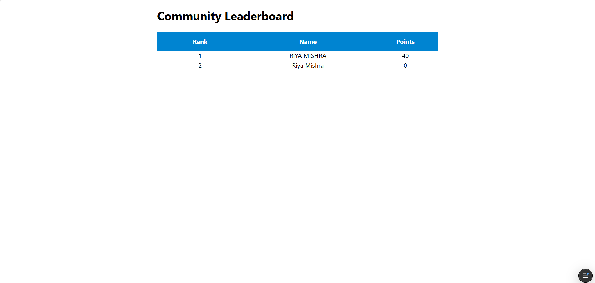
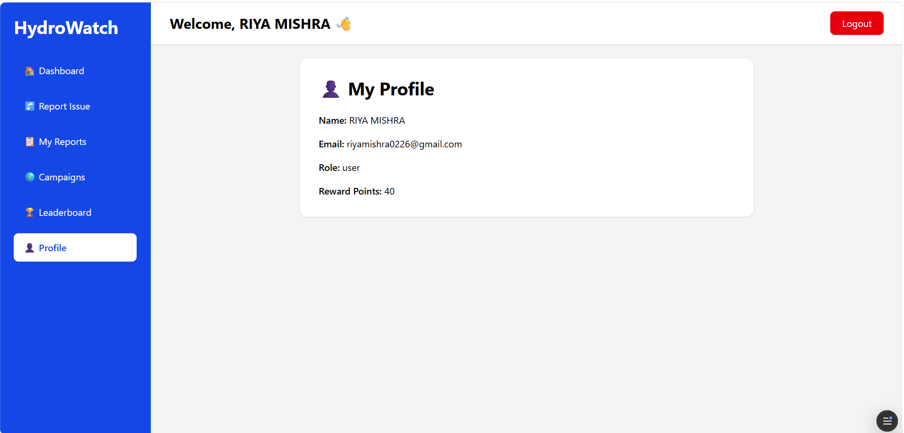

# 💧 HydroWatch Community Portal

<div align="center">

### 🌍 Empowering Communities to Report, Track & Protect Water Resources

A full-stack **MERN** application that enables citizens to report water-related issues, participate in environmental campaigns, and contribute to sustainable water resource management.


</div>

---

# 📖 Overview

HydroWatch Community Portal is a full-stack MERN application that encourages citizens to report water-related issues, participate in environmental campaigns, and contribute to sustainable water resource management.

The platform enables users to:

- 💧 Report water-related issues
- 🏆 Earn contribution points
- 📊 View community leaderboard
- 🌱 Participate in awareness campaigns
- 👤 Manage their profile securely

This project aligns with **United Nations Sustainable Development Goal (SDG) 6 – Clean Water and Sanitation**.

---

# 🚀 Live Demo

**Frontend:** https://hydrowatch-community-portal.vercel.app/

**Backend:** https://hydrowatch-backend.onrender.com/

---

# ✨ Features

- 🔐 Secure User Authentication (JWT)
- 👤 User Registration & Login
- 💧 Water Issue Reporting
- 📊 Community Dashboard
- 🏆 Leaderboard Based on Contribution Points
- 🌱 Environmental Campaigns
- 👤 User Profile
- 📱 Responsive UI

---

# 🛠 Tech Stack

| Category | Technologies |
|----------|--------------|
| Frontend | React, Vite, Tailwind CSS, React Router, Axios |
| Backend | Node.js, Express.js |
| Database | MongoDB Atlas, Mongoose |
| Authentication | JWT, bcrypt |
| Validation | React Hook Form, Zod |
| Deployment | Vercel, Render |

---

# 📂 Project Structure

```text
hydrowatch-community-portal/
├── backend/
│   ├── config/
│   ├── controllers/
│   ├── middleware/
│   ├── models/
│   ├── routes/
│   ├── package.json
│   └── server.js
│
├── frontend/
│   ├── public/
│   ├── src/
│   │   ├── api/
│   │   ├── assets/
│   │   ├── components/
│   │   ├── pages/
│   │   ├── services/
│   │   ├── validations/
│   │   ├── App.jsx
│   │   └── main.jsx
│   ├── package.json
│   └── vite.config.js
│
├── README.md
└── LICENSE
```

---

# ⚙️ Installation

```bash
git clone https://github.com/riyamishra0226/hydrowatch-community-portal.git
cd hydrowatch-community-portal
```

Install frontend:

```bash
cd frontend
npm install
npm run dev
```

Install backend:

```bash
cd ../backend
npm install
npm run dev
```

### Environment Variables

Backend `.env`

```env
PORT=5000
MONGO_URI=your_mongodb_connection_string
JWT_SECRET=your_secret_key
```

Frontend `.env`

```env
VITE_API_URL=http://localhost:5000
```

---

<h2>📸 Project Screenshots</h2>

<h3>Home Page</h3>
<p align="center">
  
</p>

<h3>Login Page</h3>
<p align="center">
  
</p>

<h3>Dashboard</h3>
<p align="center">
  
</p>

<h3>Report Issue</h3>
<p align="center">
  
</p>

<h3>Leaderboard</h3>
<p align="center">
  
</p>

<h3>Campaigns</h3>
<p align="center">
  
</p>

<h3>Profile</h3>
<p align="center">
  
</p>

---

# 🌍 SDG Alignment

This project supports **SDG 6 – Clean Water and Sanitation** by promoting community participation, awareness, and reporting of water-related issues.

---

# 🔮 Future Improvements

- 📍 Google Maps integration
- 📸 Image upload with reports
- 🤖 AI-assisted issue classification
- 🔔 Notifications
- 📊 Analytics dashboard
- 🏅 Achievement badges
- 🌐 Multi-language support
- 📱 Progressive Web App (PWA)
- 👨‍💼 Admin dashboard

---

# 🤝 Contributing

1. Fork the repository.
2. Create a feature branch.
3. Commit your changes.
4. Push the branch.
5. Open a Pull Request.

---

# 👩‍💻 Author

**Riya Mishra**

B.Tech Computer Science & Engineering

GitHub: https://github.com/riyamishra0226

---

## 📜 License

This project is licensed under the **MIT License**.

See the [LICENSE](LICENSE) file for more information.
<div align="center">
<br>

### ⭐ If you found this project helpful, please give it a Star!

Built with ❤️ using the MERN Stack

</div>
