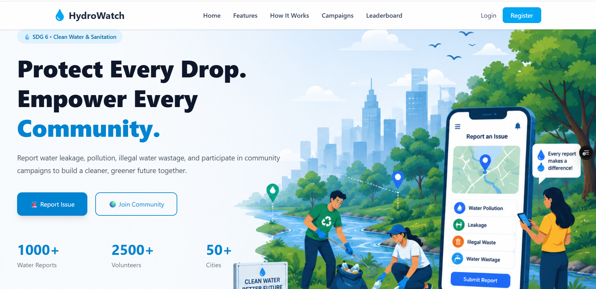
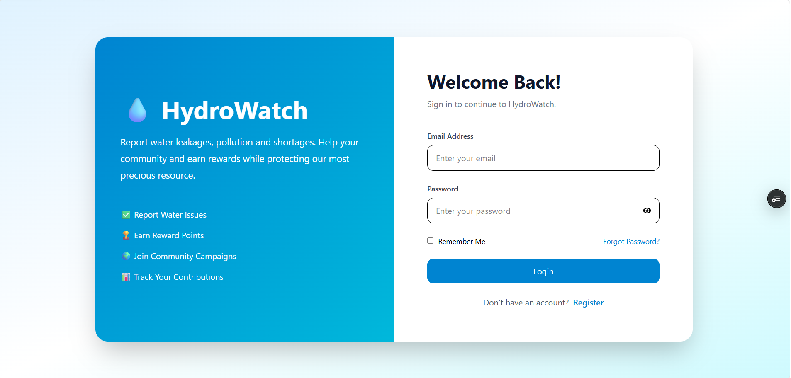
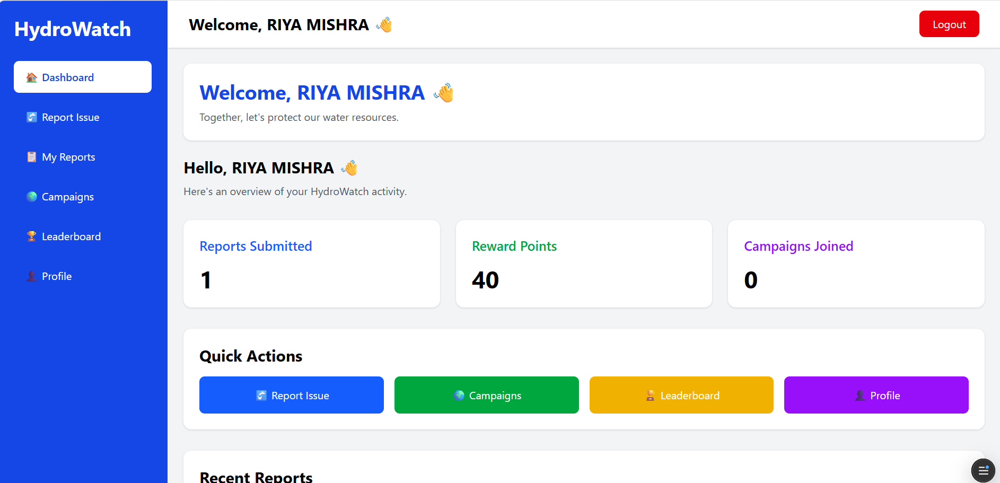
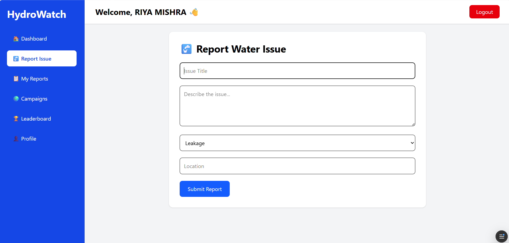
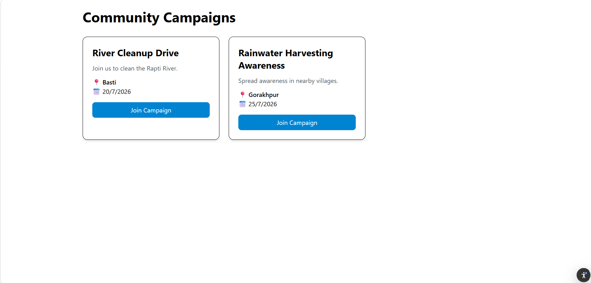
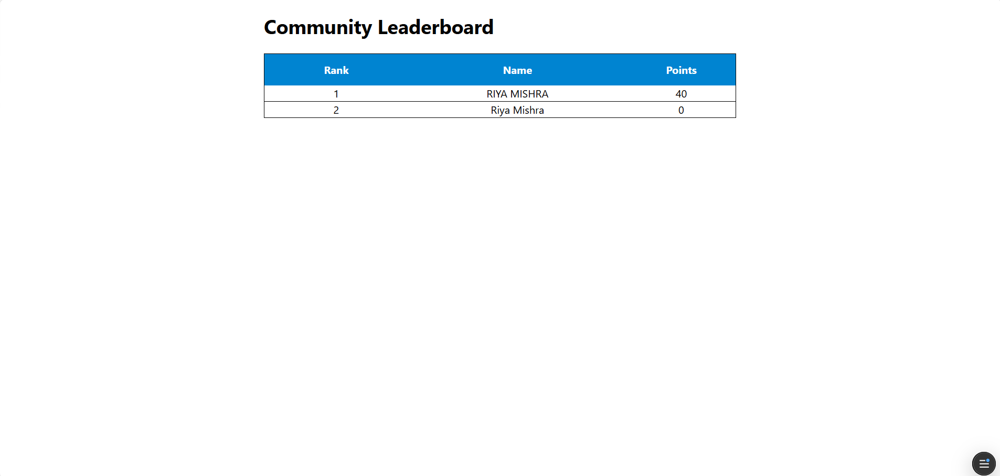
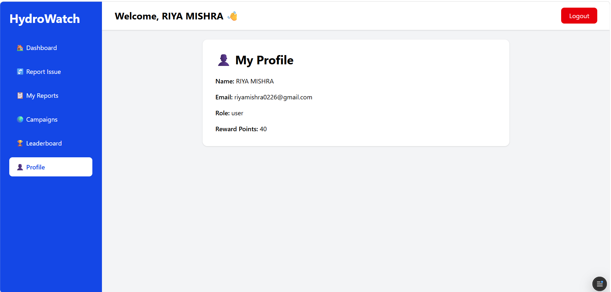

# 💧 HydroWatch – Smart Community Water Management Platform

<p align="center">
  
  
  
  
  
  
</p>

<p align="center">
  
  
  
  
</p>

<p align="center">
  
  
  
</p>

---

## 📌 Overview

**HydroWatch** is a smart community-based water management platform designed to help citizens report and track water-related issues while enabling administrators and volunteers to coordinate community activities.

The platform provides a centralized system for:

- 💧 Reporting water-related problems
- 🗺️ Locating issues on an interactive map
- 🔎 Tracking report status
- 👨‍💼 Managing reports through an admin dashboard
- 🤝 Managing volunteers and community campaigns
- 🏆 Rewarding community participation
- 📊 Visualizing water-management analytics
- 🔔 Sending notifications
- 👥 Building community participation through a leaderboard

HydroWatch follows a role-based architecture with three major roles:

**User → Volunteer → Admin**

---

# 🎯 Project Objectives

The primary objectives of HydroWatch are:

1. Provide citizens with an easy way to report water-related issues.
2. Allow users to attach issue details, images, and locations.
3. Enable administrators to review and manage submitted reports.
4. Introduce a structured report-status workflow.
5. Encourage community participation through rewards.
6. Allow volunteers to organize verified water-awareness campaigns.
7. Provide administrators with analytics and management tools.
8. Display water-related issues geographically using an interactive map.
9. Improve communication using notifications.
10. Support community participation toward **SDG 6 – Clean Water and Sanitation**.

---

# ✨ Key Features

## 🔐 Authentication & Authorization

- User registration and login
- JWT-based authentication
- Password hashing using bcrypt
- Protected routes
- Role-based access control
- User / Volunteer / Admin roles
- Forgot-password functionality
- Secure API authorization

---

## 💧 Water Issue Reporting

Users can report different types of water-related problems.

### Supported Issue Categories

- Water Leakage
- Water Pollution
- Pipeline Damage
- Water Wastage
- Other Water Issues

Each report can contain:

- Issue category
- Severity
- Description
- Location
- Latitude / Longitude
- Uploaded image
- Report status
- Submission timestamp

---

## 🗺️ Interactive Map

HydroWatch provides an interactive map for displaying issue locations.

The map functionality uses:

- Leaflet
- OpenStreetMap
- Browser Geolocation API
- Latitude and Longitude coordinates

Users can use their current location while submitting reports.

Administrators can also view reported issues geographically.

---

## 🔄 Report Status Workflow

Reports follow a structured lifecycle:

```text
┌───────────┐
│  Pending  │
└─────┬─────┘
      ↓
┌────────────────┐
│  Under Review  │
└───────┬────────┘
        ↓
┌────────────────┐
│  In Progress   │
└───────┬────────┘
        ↓
┌───────────────┐
│   Resolved    │
└───────────────┘
```

### Status Description

| Status | Description |
|---|---|
| Pending | Newly submitted report |
| Under Review | Report is being verified |
| In Progress | Action has been initiated |
| Resolved | Issue has been resolved |

---

# 👨‍💼 Admin Dashboard

Administrators have access to a centralized management dashboard.

### Admin Functionality

- 📋 Report management
- 👥 User management
- 🤝 Volunteer management
- 📢 Campaign management
- ✅ Campaign verification
- 📊 Analytics
- 🗺️ Issue map
- 🔔 Notifications
- 🏆 Community activity monitoring

Admins can manage the complete lifecycle of community reports and campaigns.

---

# 🤝 Volunteer System

Users can apply to become volunteers.

The volunteer application contains:

- Reason for becoming a volunteer
- Previous experience
- Availability

### Volunteer Application Workflow

```text
             ┌──────────────┐
             │     User     │
             └──────┬───────┘
                    ↓
        ┌─────────────────────┐
        │ Apply for Volunteer │
        └──────────┬──────────┘
                   ↓
             ┌───────────┐
             │  Pending  │
             └─────┬─────┘
                   │
          ┌────────┴────────┐
          ↓                 ↓
   ┌────────────┐    ┌────────────┐
   │  Rejected  │    │  Approved  │
   └────────────┘    └──────┬─────┘
                            ↓
                    ┌──────────────┐
                    │  Volunteer   │
                    │     Role     │
                    └──────────────┘
```

Administrators can:

- Review applications
- Approve applications
- Reject applications
- Add administrative notes

---

# 📢 Community Campaigns

Volunteers and administrators can create community campaigns.

Examples:

- Water conservation drives
- Clean water awareness campaigns
- Community cleanup activities
- Water-saving awareness programs

### Campaign Workflow

```text
┌──────────────────────────┐
│ Volunteer Creates        │
│ Campaign                 │
└────────────┬─────────────┘
             ↓
┌──────────────────────────┐
│ Pending Verification     │
└────────────┬─────────────┘
             ↓
┌──────────────────────────┐
│ Admin Review             │
└────────────┬─────────────┘
             ↓
       ┌─────┴─────┐
       ↓           ↓
   ┌────────┐  ┌──────────┐
   │ Reject │  │  Verify  │
   └────────┘  └────┬─────┘
                    ↓
            ┌──────────────┐
            │  Published   │
            └──────┬───────┘
                   ↓
       ┌─────────────────────┐
       │ Community           │
       │ Participation       │
       └─────────────────────┘
```

### Campaign Features

- Campaign title
- Description
- Location
- Date
- Start / End date
- Reward points
- Maximum participants
- Organizer contact
- Campaign status
- Participant management
- Participation verification

---

# 🏆 Rewards & Leaderboard

HydroWatch uses a reward mechanism to encourage community participation.

### Report Rewards

| Activity | Reward |
|---|---:|
| Submit Report | +5 |
| Report Under Review | +5 |
| Report Resolved | +10 |

### Campaign Rewards

Campaign participation rewards are defined by the campaign and awarded after participation is verified.

### Reward Reversal

Rewards can also be reversed when a report status moves backward or when a report is deleted according to the implemented reward rules.

Administrators are excluded from community leaderboard reward accumulation.

---

# 🔔 Notifications

The notification system helps users stay informed about important activities.

Notifications can be associated with:

- Report status updates
- Campaign activities
- Volunteer application updates
- Community activities

---

# 📊 Analytics Dashboard

HydroWatch provides analytics based on application data.

The dashboard can provide insights into:

- Total reports
- Report status distribution
- Issue categories
- Community activity
- Campaign information
- User participation

Charts are implemented using **Recharts**.

---

# 👤 User Profile

Users have access to their profile information and community activity.

The profile system can contain:

- User information
- Role
- Reward points
- Reports
- Community participation
- Account information

---

# 🛠️ Technology Stack

| Layer | Technology |
|---|---|
| Frontend | React 19 |
| Build Tool | Vite 8 |
| Styling | Tailwind CSS 4 |
| Routing | React Router |
| Backend | Node.js |
| Server | Express.js 5 |
| Database | MongoDB Atlas |
| ODM | Mongoose |
| Authentication | JWT |
| Password Security | bcryptjs |
| HTTP Client | Axios |
| Form Management | React Hook Form |
| Validation | Zod |
| Charts | Recharts |
| Maps | Leaflet + OpenStreetMap |
| Notifications | React Hot Toast |
| Animations | Framer Motion |
| Icons | React Icons |
| Frontend Deployment | Vercel |
| Backend Deployment | Render |

---

# 🏗️ System Architecture

```text
                         ┌───────────────────────┐
                         │         Users         │
                         │ User / Volunteer /    │
                         │        Admin          │
                         └───────────┬───────────┘
                                     │
                                     ▼
                         ┌───────────────────────┐
                         │   React Frontend      │
                         │        + Vite         │
                         └───────────┬───────────┘
                                     │
                                     │ REST API
                                     ▼
                         ┌───────────────────────┐
                         │   Node.js + Express   │
                         │        Backend        │
                         └───────────┬───────────┘
                                     │
             ┌───────────────────────┼───────────────────────┐
             │                       │                       │
             ▼                       ▼                       ▼
      ┌─────────────┐        ┌─────────────┐        ┌─────────────┐
      │     Auth    │        │   Reports   │        │  Campaigns  │
      └─────────────┘        └─────────────┘        └─────────────┘
             │                       │                       │
             └───────────────────────┼───────────────────────┘
                                     │
                                     ▼
                         ┌───────────────────────┐
                         │     MongoDB Atlas     │
                         └───────────────────────┘
```

---

# 📁 Project Structure

```text
HydroWatch/
│
├── backend/
│   ├── config/
│   ├── controllers/
│   ├── middleware/
│   ├── models/
│   ├── routes/
│   ├── server.js
│   └── package.json
│
├── frontend/
│   ├── public/
│   ├── src/
│   │   ├── api/
│   │   ├── assets/
│   │   ├── components/
│   │   ├── context/
│   │   ├── hooks/
│   │   ├── pages/
│   │   ├── routes/
│   │   ├── services/
│   │   ├── validations/
│   │   ├── App.jsx
│   │   └── main.jsx
│   │
│   ├── package.json
│   └── vite.config.js
│
├── screenshots/
│   ├── ss_homepage.png
│   ├── ss_login.png
│   ├── ss_dashboard.png
│   ├── ss_campaigns.png
│   ├── ss_leaderboard.png
│   ├── ss_profile.png
│   └── ss_Report_Issue.png
│
└── README.md
```

---

# 🚀 Getting Started

## 1. Clone the Repository

```bash
git clone https://github.com/riyamishra0226/hydrowatch-community-portal.git
```

```bash
cd hydrowatch-community-portal
```

---

# ⚙️ Backend Setup

Navigate to the backend directory:

```bash
cd backend
```

Install dependencies:

```bash
npm install
```

Create a `.env` file inside the `backend` directory:

```env
PORT=5000

MONGODB_URI=your_mongodb_atlas_connection_string

JWT_SECRET=your_secure_secret_key_at_least_32_characters_long

FRONTEND_URL=http://localhost:5173
```

### Important

The `JWT_SECRET` should contain at least **32 characters** according to the backend validation.

Start the backend:

```bash
npm run dev
```

Backend:

```text
http://localhost:5000
```

---

# 💻 Frontend Setup

Open another terminal and navigate to the frontend:

```bash
cd frontend
```

Install dependencies:

```bash
npm install
```

Create a `.env` file inside the `frontend` directory:

```env
VITE_API_URL=http://localhost:5000
```

Start the frontend:

```bash
npm run dev
```

Frontend:

```text
http://localhost:5173
```

---

# 🔑 Environment Variables

## Backend

| Variable | Description |
|---|---|
| `PORT` | Backend server port |
| `MONGODB_URI` | MongoDB Atlas connection string |
| `JWT_SECRET` | JWT signing secret |
| `FRONTEND_URL` | Frontend URL |

## Frontend

| Variable | Description |
|---|---|
| `VITE_API_URL` | Backend API base URL |

---

# 🔌 API Structure

The backend exposes REST API groups:

```text
/api/auth
/api/reports
/api/campaigns
/api/notifications
/api/rewards
```

## Authentication

```text
/api/auth
```

Handles:

- Registration
- Login
- Current user
- Password recovery
- Volunteer applications
- User authorization

## Reports

```text
/api/reports
```

Handles:

- Create reports
- Retrieve reports
- Update reports
- Delete reports
- Report status management

## Campaigns

```text
/api/campaigns
```

Handles:

- Campaign creation
- Campaign retrieval
- Campaign updates
- Campaign deletion
- Campaign verification
- Campaign participation
- Participation verification

## Notifications

```text
/api/notifications
```

Handles notification-related operations.

## Rewards

```text
/api/rewards
```

Handles reward-related operations.

---

# 👥 User Roles

| Feature | User | Volunteer | Admin |
|---|:---:|:---:|:---:|
| Register / Login | ✅ | ✅ | ✅ |
| Report Issue | ✅ | ✅ | — |
| View Own Reports | ✅ | ✅ | — |
| Rewards | ✅ | ✅ | ❌ |
| Leaderboard | ✅ | ✅ | ❌ |
| Apply for Volunteer | ✅ | ❌ | ❌ |
| Create Campaign | ❌ | ✅ | ✅ |
| Manage Own Campaign | ❌ | ✅ | ✅ |
| Verify Campaign | ❌ | ❌ | ✅ |
| Manage Reports | ❌ | ❌ | ✅ |
| Manage Users | ❌ | ❌ | ✅ |
| Manage Volunteers | ❌ | ❌ | ✅ |
| Analytics | ❌ | ❌ | ✅ |

---

# 🧪 Testing Checklist

Before deployment, verify:

## Authentication

- [ ] User registration works
- [ ] Login works
- [ ] Logout redirects correctly
- [ ] Protected routes work
- [ ] Unauthorized users cannot access protected pages

## Reports

- [ ] Report submission works
- [ ] Image upload works
- [ ] Location is correct
- [ ] Report status updates work
- [ ] Users can view their own reports
- [ ] Report deletion follows authorization rules

## Rewards

- [ ] Report reward is added correctly
- [ ] Status-based rewards work
- [ ] Reward reversal works
- [ ] Campaign reward works
- [ ] Admin accounts are excluded from community rewards

## Campaigns

- [ ] Volunteer can create campaigns
- [ ] Campaign requires verification
- [ ] Admin can verify campaigns
- [ ] Users can join campaigns
- [ ] Participation verification works

## Admin

- [ ] Admin dashboard loads
- [ ] Reports are visible
- [ ] User management works
- [ ] Volunteer applications work
- [ ] Campaign verification works
- [ ] Analytics display correctly

---

# 📸 Screenshots

## 🏠 Homepage



---

## 🔐 Login



---

## 📊 Dashboard



---

## 💧 Report Issue



---

## 📢 Campaigns



---

## 🏆 Leaderboard



---

## 👤 Profile



---

# 🌐 Deployment

HydroWatch uses the following deployment architecture:

```text
Frontend  → Vercel
Backend   → Render
Database  → MongoDB Atlas
```

### 🌍 Live Frontend

https://hydrowatch-community-portal.vercel.app/

### ⚙️ Backend

https://hydrowatch-backend.onrender.com/


---

# 🔒 Security

HydroWatch implements several security mechanisms:

- JWT authentication
- Password hashing using bcrypt
- Protected API routes
- Role-based authorization
- Ownership checks
- ObjectId validation
- Environment variables for secrets
- CORS configuration
- Input validation
- Restricted administrative operations

### Security Recommendation

Never commit `.env` files or database credentials to GitHub.

Make sure the following are included in `.gitignore`:

```text
.env
.env.local
node_modules/
dist/
```

---

# 📈 Future Scope

The following improvements can be considered for future versions:

- 🤖 AI-based water issue classification
- 📷 Automatic image-based issue detection
- 📊 Predictive analytics for water-related problems
- 🛰️ IoT sensor integration
- 🚰 Real-time water-quality monitoring
- 📱 Progressive Web App / mobile application
- 🧠 Machine-learning-based issue prioritization
- 🗺️ Advanced GIS-based analysis
- 📩 Email/SMS alerts
- 🏛️ Integration with municipal/government systems
- ☁️ Scalable cloud architecture
- 📡 Real-time IoT data streaming

> These are **future-scope enhancements** and should not be considered implemented functionality unless they are separately integrated into the project.

---

# 🌱 SDG 6 – Clean Water and Sanitation

HydroWatch is conceptually aligned with:

**United Nations Sustainable Development Goal 6 – Clean Water and Sanitation.**

The platform supports community participation in identifying and reporting water-related problems and promotes awareness through community campaigns.

---


# 🤝 Contributing

Contributions are welcome.

### 1. Fork the repository

### 2. Clone your fork

```bash
git clone <your-fork-url>
```

### 3. Create a feature branch

```bash
git checkout -b feature/your-feature
```

### 4. Make your changes

### 5. Commit your changes

```bash
git add .
git commit -m "Add your feature"
```

### 6. Push the branch

```bash
git push origin feature/your-feature
```

### 7. Create a Pull Request

---

# 📄 License

This project is released under the **MIT License**.

---

# ⭐ Support

If you find HydroWatch useful, consider giving the repository a ⭐ on GitHub.

---

<p align="center">

<b>💧 HydroWatch</b>

Smart Community Water Management Platform

Built with React, Node.js, Express and MongoDB

</p>
